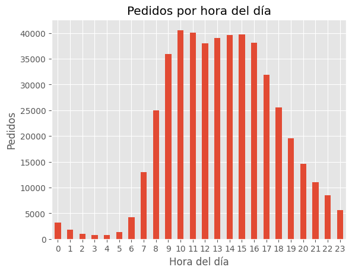
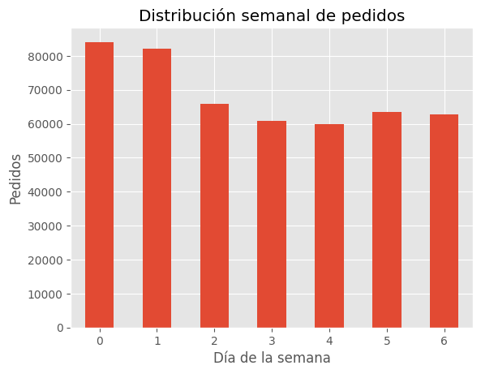
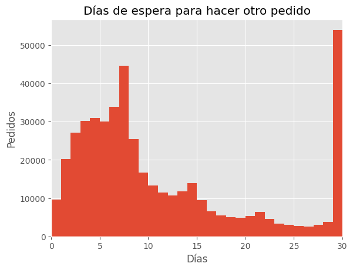
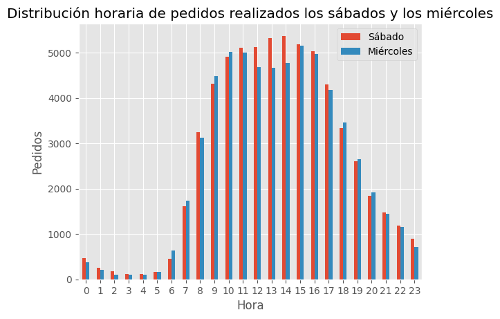
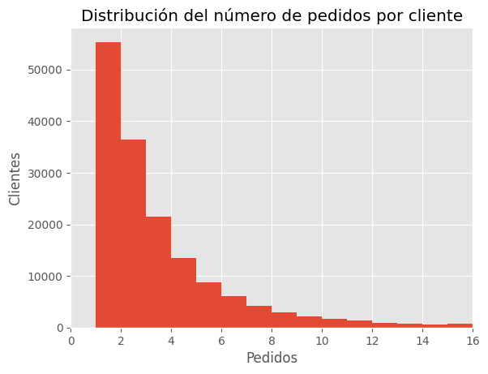
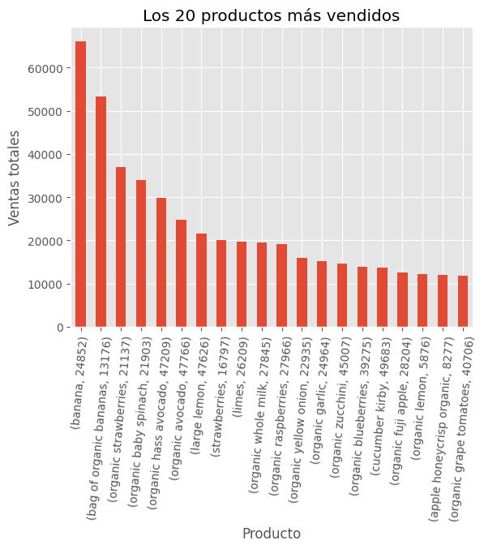
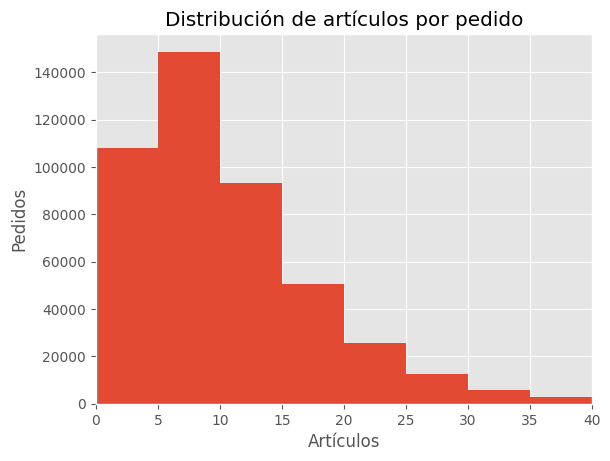
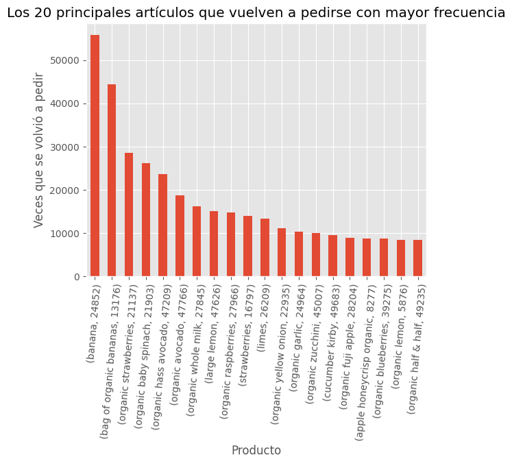
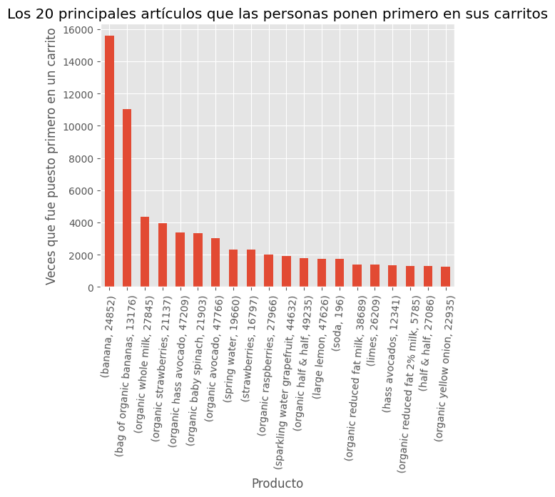

<h1>Tabla de contenidos<span class="tocSkip"></span></h1>
<div class="toc"><ul class="toc-item"><li><span><a href="#Paso-1.-Descripción-de-los-datos" data-toc-modified-id="Paso-1.-Descripción-de-los-datos-1"><span class="toc-item-num">1&nbsp;&nbsp;</span>Paso 1. Descripción de los datos</a></span><ul class="toc-item"><li><span><a href="#Conclusiones" data-toc-modified-id="Conclusiones-1.1"><span class="toc-item-num">1.1&nbsp;&nbsp;</span>Conclusiones</a></span></li></ul></li><li><span><a href="#Paso-2.-Preprocesamiento-de-los-datos" data-toc-modified-id="Paso-2.-Preprocesamiento-de-los-datos-2"><span class="toc-item-num">2&nbsp;&nbsp;</span>Paso 2. Preprocesamiento de los datos</a></span><ul class="toc-item"><li><span><a href="#Encontrar-y-eliminar-valores-duplicados" data-toc-modified-id="Encontrar-y-eliminar-valores-duplicados-2.1"><span class="toc-item-num">2.1&nbsp;&nbsp;</span>Encontrar y eliminar valores duplicados</a></span><ul class="toc-item"><li><span><a href="#orders-data-frame" data-toc-modified-id="orders-data-frame-2.1.1"><span class="toc-item-num">2.1.1&nbsp;&nbsp;</span><code>orders</code> data frame</a></span></li><li><span><a href="#products-data-frame" data-toc-modified-id="products-data-frame-2.1.2"><span class="toc-item-num">2.1.2&nbsp;&nbsp;</span><code>products</code> data frame</a></span></li><li><span><a href="#departments-data-frame" data-toc-modified-id="departments-data-frame-2.1.3"><span class="toc-item-num">2.1.3&nbsp;&nbsp;</span><code>departments</code> data frame</a></span></li><li><span><a href="#aisles-data-frame" data-toc-modified-id="aisles-data-frame-2.1.4"><span class="toc-item-num">2.1.4&nbsp;&nbsp;</span><code>aisles</code> data frame</a></span></li><li><span><a href="#order_products-data-frame" data-toc-modified-id="order_products-data-frame-2.1.5"><span class="toc-item-num">2.1.5&nbsp;&nbsp;</span><code>order_products</code> data frame</a></span></li></ul></li><li><span><a href="#Encuentra-y-elimina-los-valores-ausentes" data-toc-modified-id="Encuentra-y-elimina-los-valores-ausentes-2.2"><span class="toc-item-num">2.2&nbsp;&nbsp;</span>Encuentra y elimina los valores ausentes</a></span><ul class="toc-item"><li><span><a href="#products-data-frame" data-toc-modified-id="products-data-frame-2.2.1"><span class="toc-item-num">2.2.1&nbsp;&nbsp;</span><code>products</code> data frame</a></span></li><li><span><a href="#orders-data-frame" data-toc-modified-id="orders-data-frame-2.2.2"><span class="toc-item-num">2.2.2&nbsp;&nbsp;</span><code>orders</code> data frame</a></span></li><li><span><a href="#order_products-data-frame" data-toc-modified-id="order_products-data-frame-2.2.3"><span class="toc-item-num">2.2.3&nbsp;&nbsp;</span><code>order_products</code> data frame</a></span></li><li><span><a href="#Conclusiones" data-toc-modified-id="Conclusiones-2.2.4"><span class="toc-item-num">2.2.4&nbsp;&nbsp;</span>Conclusiones</a></span></li></ul></li></ul></li><li><span><a href="#Paso-3.-Análisis-de-los-datos" data-toc-modified-id="Paso-3.-Análisis-de-los-datos-3"><span class="toc-item-num">3&nbsp;&nbsp;</span>Paso 3. Análisis de los datos</a></span><ul class="toc-item"><li><span><a href="#Análisis-básico" data-toc-modified-id="Análisis-básico-3.1"><span class="toc-item-num">3.1&nbsp;&nbsp;</span>Análisis básico</a></span><ul class="toc-item"><li><span><a href="#Verificar-que-los-valores-sean-sensibles" data-toc-modified-id="Verificar-que-los-valores-sean-sensibles-3.1.1"><span class="toc-item-num">3.1.1&nbsp;&nbsp;</span>Verificar que los valores sean sensibles</a></span></li><li><span><a href="#Para-cada-hora-del-día,-¿cuántas-personas-hacen-órdenes?" data-toc-modified-id="Para-cada-hora-del-día,-¿cuántas-personas-hacen-órdenes?-3.1.2"><span class="toc-item-num">3.1.2&nbsp;&nbsp;</span>Para cada hora del día, ¿cuántas personas hacen órdenes?</a></span></li><li><span><a href="#¿Qué-día-de-la-semana-compran-víveres-las-personas?" data-toc-modified-id="¿Qué-día-de-la-semana-compran-víveres-las-personas?-3.1.3"><span class="toc-item-num">3.1.3&nbsp;&nbsp;</span>¿Qué día de la semana compran víveres las personas?</a></span></li><li><span><a href="#¿Cuánto-tiempo-esperan-las-personas-hasta-hacer-otro-pedido?" data-toc-modified-id="¿Cuánto-tiempo-esperan-las-personas-hasta-hacer-otro-pedido?-3.1.4"><span class="toc-item-num">3.1.4&nbsp;&nbsp;</span>¿Cuánto tiempo esperan las personas hasta hacer otro pedido?</a></span></li></ul></li><li><span><a href="#Análisis-Intermedio" data-toc-modified-id="Análisis-Intermedio-3.2"><span class="toc-item-num">3.2&nbsp;&nbsp;</span>Análisis Intermedio</a></span><ul class="toc-item"><li><span><a href="#Diferencia-entre-miércoles-y-sábados-para--'order_hour_of_day'" data-toc-modified-id="Diferencia-entre-miércoles-y-sábados-para--'order_hour_of_day'-3.2.1"><span class="toc-item-num">3.2.1&nbsp;&nbsp;</span>Diferencia entre miércoles y sábados para  <code>'order_hour_of_day'</code></a></span></li><li><span><a href="#¿Cuál-es-la-distribución-para-el-número-de-pedidos-por-cliente?" data-toc-modified-id="¿Cuál-es-la-distribución-para-el-número-de-pedidos-por-cliente?-3.2.2"><span class="toc-item-num">3.2.2&nbsp;&nbsp;</span>¿Cuál es la distribución para el número de pedidos por cliente?</a></span></li><li><span><a href="#¿Cuáles-son-los-20-productos-más-populares?" data-toc-modified-id="¿Cuáles-son-los-20-productos-más-populares?-3.2.3"><span class="toc-item-num">3.2.3&nbsp;&nbsp;</span>¿Cuáles son los 20 productos más populares?</a></span></li></ul></li><li><span><a href="#Análisis-avanzado" data-toc-modified-id="Análisis-avanzado-3.3"><span class="toc-item-num">3.3&nbsp;&nbsp;</span>Análisis avanzado</a></span><ul class="toc-item"><li><span><a href="#¿Cuántos-artículos-compran-normalmente-las-personas-en-un-pedido?-¿Cómo-es-la-distribución?" data-toc-modified-id="¿Cuántos-artículos-compran-normalmente-las-personas-en-un-pedido?-¿Cómo-es-la-distribución?-3.3.1"><span class="toc-item-num">3.3.1&nbsp;&nbsp;</span>¿Cuántos artículos compran normalmente las personas en un pedido? ¿Cómo es la distribución?</a></span></li><li><span><a href="#¿Cuáles-son-los-20-principales-artículos-que-vuelven-a-pedirse-con-mayor-frecuencia?" data-toc-modified-id="¿Cuáles-son-los-20-principales-artículos-que-vuelven-a-pedirse-con-mayor-frecuencia?-3.3.2"><span class="toc-item-num">3.3.2&nbsp;&nbsp;</span>¿Cuáles son los 20 principales artículos que vuelven a pedirse con mayor frecuencia?</a></span></li><li><span><a href="#Para-cada-producto,-¿cuál-es-la-proporción-de-las-veces-que-se-pide-y-que-se-vuelve-a-pedir?" data-toc-modified-id="Para-cada-producto,-¿cuál-es-la-proporción-de-las-veces-que-se-pide-y-que-se-vuelve-a-pedir?-3.3.3"><span class="toc-item-num">3.3.3&nbsp;&nbsp;</span>Para cada producto, ¿cuál es la proporción de las veces que se pide y que se vuelve a pedir?</a></span></li><li><span><a href="#Para-cada-cliente,-¿qué-proporción-de-sus-productos-ya-los-había-pedido?" data-toc-modified-id="Para-cada-cliente,-¿qué-proporción-de-sus-productos-ya-los-había-pedido?-3.3.4"><span class="toc-item-num">3.3.4&nbsp;&nbsp;</span>Para cada cliente, ¿qué proporción de sus productos ya los había pedido?</a></span></li><li><span><a href="#¿Cuáles-son-los-20-principales-artículos-que-las-personas-ponen-primero-en-sus-carritos?" data-toc-modified-id="¿Cuáles-son-los-20-principales-artículos-que-las-personas-ponen-primero-en-sus-carritos?-3.3.5"><span class="toc-item-num">3.3.5&nbsp;&nbsp;</span>¿Cuáles son los 20 principales artículos que las personas ponen primero en sus carritos?</a></span></li></ul></li></ul></li><li><span><a href="#Conclusion-general-del-proyecto:" data-toc-modified-id="Conclusion-general-del-proyecto:-4"><span class="toc-item-num">4&nbsp;&nbsp;</span>Conclusion general del proyecto:</a></span></li></ul></div>

# Introducción

Instacart es una plataforma de entregas de comestibles donde la clientela puede registrar un pedido y hacer que se lo entreguen, similar a Uber Eats y Door Dash.

Se deben completar tres pasos. Para cada uno de ellos, se escribirá una breve introducción que reflejará con claridad cómo se resolverá cada paso, y se escribirán párrafos explicatorios que justificando las decisiones al tiempo que se avanza en la solución.  Finalmente irá una conclusión que resumirá todos los hallazgos y elecciones.

# Diccionario de datos

Hay cinco tablas en el conjunto de datos, y todas son necesarias para hacer el preprocesamiento de datos y el análisis exploratorio de datos. A continuación se muestra un diccionario de datos que enumera las columnas de cada tabla y describe los datos que contienen.

- `instacart_orders.csv`: cada fila corresponde a un pedido en la aplicación Instacart.
    - `'order_id'`: número de ID que identifica de manera única cada pedido.
    - `'user_id'`: número de ID que identifica de manera única la cuenta de cada cliente.
    - `'order_number'`: el número de veces que este cliente ha hecho un pedido.
    - `'order_dow'`: día de la semana en que se hizo el pedido (0 si es domingo).
    - `'order_hour_of_day'`: hora del día en que se hizo el pedido.
    - `'days_since_prior_order'`: número de días transcurridos desde que este cliente hizo su pedido anterior.
- `products.csv`: cada fila corresponde a un producto único que pueden comprar los clientes.
    - `'product_id'`: número ID que identifica de manera única cada producto.
    - `'product_name'`: nombre del producto.
    - `'aisle_id'`: número ID que identifica de manera única cada categoría de pasillo de víveres.
    - `'department_id'`: número ID que identifica de manera única cada departamento de víveres.
- `order_products.csv`: cada fila corresponde a un artículo pedido en un pedido.
    - `'order_id'`: número de ID que identifica de manera única cada pedido.
    - `'product_id'`: número ID que identifica de manera única cada producto.
    - `'add_to_cart_order'`: el orden secuencial en el que se añadió cada artículo en el carrito.
    - `'reordered'`: 0 si el cliente nunca ha pedido este producto antes, 1 si lo ha pedido.
- `aisles.csv`
    - `'aisle_id'`: número ID que identifica de manera única cada categoría de pasillo de víveres.
    - `'aisle'`: nombre del pasillo.
- `departments.csv`
    - `'department_id'`: número ID que identifica de manera única cada departamento de víveres.
    - `'department'`: nombre del departamento.

## Paso 1. Descripción de los datos

Se importarán los datasets (`/datasets/instacart_orders.csv`, `/datasets/products.csv`, `/datasets/aisles.csv`, `/datasets/departments.csv` y `/datasets/order_products.csv`) con `pd.read_csv()` usando los parámetros adecuados para leer los datos correctamente. Se verificará la información para cada DataFrame creado.


```python
import pandas as pd # importar librerías
from matplotlib import pyplot as plt
```


```python
plt.style.use('ggplot') #Dar estilo a los gráficos del informe
```


```python
instacart_orders = pd.read_csv('/datasets/instacart_orders.csv', sep=';') 
products = pd.read_csv('/datasets/products.csv', sep=';')
aisles = pd.read_csv('/datasets/aisles.csv', sep=';')
departments = pd.read_csv('/datasets/departments.csv', sep=';')
order_products = pd.read_csv('/datasets/order_products.csv', sep=';') # leer conjuntos de datos en los DataFrames
```


```python
instacart_orders.info() # mostrar información del DataFrame
instacart_orders.head()
```

    <class 'pandas.core.frame.DataFrame'>
    RangeIndex: 478967 entries, 0 to 478966
    Data columns (total 6 columns):
     #   Column                  Non-Null Count   Dtype  
    ---  ------                  --------------   -----  
     0   order_id                478967 non-null  int64  
     1   user_id                 478967 non-null  int64  
     2   order_number            478967 non-null  int64  
     3   order_dow               478967 non-null  int64  
     4   order_hour_of_day       478967 non-null  int64  
     5   days_since_prior_order  450148 non-null  float64
    dtypes: float64(1), int64(5)
    memory usage: 21.9 MB


<div>
<style scoped>
    .dataframe tbody tr th:only-of-type {
        vertical-align: middle;
    }

    .dataframe tbody tr th {
        vertical-align: top;
    }

    .dataframe thead th {
        text-align: right;
    }
</style>
<table border="1" class="dataframe">
  <thead>
    <tr style="text-align: right;">
      <th></th>
      <th>order_id</th>
      <th>user_id</th>
      <th>order_number</th>
      <th>order_dow</th>
      <th>order_hour_of_day</th>
      <th>days_since_prior_order</th>
    </tr>
  </thead>
  <tbody>
    <tr>
      <th>0</th>
      <td>1515936</td>
      <td>183418</td>
      <td>11</td>
      <td>6</td>
      <td>13</td>
      <td>30.0</td>
    </tr>
    <tr>
      <th>1</th>
      <td>1690866</td>
      <td>163593</td>
      <td>5</td>
      <td>5</td>
      <td>12</td>
      <td>9.0</td>
    </tr>
    <tr>
      <th>2</th>
      <td>1454967</td>
      <td>39980</td>
      <td>4</td>
      <td>5</td>
      <td>19</td>
      <td>2.0</td>
    </tr>
    <tr>
      <th>3</th>
      <td>1768857</td>
      <td>82516</td>
      <td>56</td>
      <td>0</td>
      <td>20</td>
      <td>10.0</td>
    </tr>
    <tr>
      <th>4</th>
      <td>3007858</td>
      <td>196724</td>
      <td>2</td>
      <td>4</td>
      <td>12</td>
      <td>17.0</td>
    </tr>
  </tbody>
</table>
</div>


```python
products.info() # mostrar información del DataFrame
products.head()
```

    <class 'pandas.core.frame.DataFrame'>
    RangeIndex: 49694 entries, 0 to 49693
    Data columns (total 4 columns):
     #   Column         Non-Null Count  Dtype 
    ---  ------         --------------  ----- 
     0   product_id     49694 non-null  int64 
     1   product_name   48436 non-null  object
     2   aisle_id       49694 non-null  int64 
     3   department_id  49694 non-null  int64 
    dtypes: int64(3), object(1)
    memory usage: 1.5+ MB


<div>
<style scoped>
    .dataframe tbody tr th:only-of-type {
        vertical-align: middle;
    }

    .dataframe tbody tr th {
        vertical-align: top;
    }

    .dataframe thead th {
        text-align: right;
    }
</style>
<table border="1" class="dataframe">
  <thead>
    <tr style="text-align: right;">
      <th></th>
      <th>product_id</th>
      <th>product_name</th>
      <th>aisle_id</th>
      <th>department_id</th>
    </tr>
  </thead>
  <tbody>
    <tr>
      <th>0</th>
      <td>1</td>
      <td>Chocolate Sandwich Cookies</td>
      <td>61</td>
      <td>19</td>
    </tr>
    <tr>
      <th>1</th>
      <td>2</td>
      <td>All-Seasons Salt</td>
      <td>104</td>
      <td>13</td>
    </tr>
    <tr>
      <th>2</th>
      <td>3</td>
      <td>Robust Golden Unsweetened Oolong Tea</td>
      <td>94</td>
      <td>7</td>
    </tr>
    <tr>
      <th>3</th>
      <td>4</td>
      <td>Smart Ones Classic Favorites Mini Rigatoni Wit...</td>
      <td>38</td>
      <td>1</td>
    </tr>
    <tr>
      <th>4</th>
      <td>5</td>
      <td>Green Chile Anytime Sauce</td>
      <td>5</td>
      <td>13</td>
    </tr>
  </tbody>
</table>
</div>


```python
aisles.info() # mostrar información del DataFrame
aisles.head()
```

    <class 'pandas.core.frame.DataFrame'>
    RangeIndex: 134 entries, 0 to 133
    Data columns (total 2 columns):
     #   Column    Non-Null Count  Dtype 
    ---  ------    --------------  ----- 
     0   aisle_id  134 non-null    int64 
     1   aisle     134 non-null    object
    dtypes: int64(1), object(1)
    memory usage: 2.2+ KB


<div>
<style scoped>
    .dataframe tbody tr th:only-of-type {
        vertical-align: middle;
    }

    .dataframe tbody tr th {
        vertical-align: top;
    }

    .dataframe thead th {
        text-align: right;
    }
</style>
<table border="1" class="dataframe">
  <thead>
    <tr style="text-align: right;">
      <th></th>
      <th>aisle_id</th>
      <th>aisle</th>
    </tr>
  </thead>
  <tbody>
    <tr>
      <th>0</th>
      <td>1</td>
      <td>prepared soups salads</td>
    </tr>
    <tr>
      <th>1</th>
      <td>2</td>
      <td>specialty cheeses</td>
    </tr>
    <tr>
      <th>2</th>
      <td>3</td>
      <td>energy granola bars</td>
    </tr>
    <tr>
      <th>3</th>
      <td>4</td>
      <td>instant foods</td>
    </tr>
    <tr>
      <th>4</th>
      <td>5</td>
      <td>marinades meat preparation</td>
    </tr>
  </tbody>
</table>
</div>


```python
departments.info() # mostrar información del DataFrame
departments.head()
```

    <class 'pandas.core.frame.DataFrame'>
    RangeIndex: 21 entries, 0 to 20
    Data columns (total 2 columns):
     #   Column         Non-Null Count  Dtype 
    ---  ------         --------------  ----- 
     0   department_id  21 non-null     int64 
     1   department     21 non-null     object
    dtypes: int64(1), object(1)
    memory usage: 464.0+ bytes


<div>
<style scoped>
    .dataframe tbody tr th:only-of-type {
        vertical-align: middle;
    }

    .dataframe tbody tr th {
        vertical-align: top;
    }

    .dataframe thead th {
        text-align: right;
    }
</style>
<table border="1" class="dataframe">
  <thead>
    <tr style="text-align: right;">
      <th></th>
      <th>department_id</th>
      <th>department</th>
    </tr>
  </thead>
  <tbody>
    <tr>
      <th>0</th>
      <td>1</td>
      <td>frozen</td>
    </tr>
    <tr>
      <th>1</th>
      <td>2</td>
      <td>other</td>
    </tr>
    <tr>
      <th>2</th>
      <td>3</td>
      <td>bakery</td>
    </tr>
    <tr>
      <th>3</th>
      <td>4</td>
      <td>produce</td>
    </tr>
    <tr>
      <th>4</th>
      <td>5</td>
      <td>alcohol</td>
    </tr>
  </tbody>
</table>
</div>


```python
order_products.info(show_counts=True) # mostrar información del DataFrame
order_products.head()
```

    <class 'pandas.core.frame.DataFrame'>
    RangeIndex: 4545007 entries, 0 to 4545006
    Data columns (total 4 columns):
     #   Column             Non-Null Count    Dtype  
    ---  ------             --------------    -----  
     0   order_id           4545007 non-null  int64  
     1   product_id         4545007 non-null  int64  
     2   add_to_cart_order  4544171 non-null  float64
     3   reordered          4545007 non-null  int64  
    dtypes: float64(1), int64(3)
    memory usage: 138.7 MB


<div>
<style scoped>
    .dataframe tbody tr th:only-of-type {
        vertical-align: middle;
    }

    .dataframe tbody tr th {
        vertical-align: top;
    }

    .dataframe thead th {
        text-align: right;
    }
</style>
<table border="1" class="dataframe">
  <thead>
    <tr style="text-align: right;">
      <th></th>
      <th>order_id</th>
      <th>product_id</th>
      <th>add_to_cart_order</th>
      <th>reordered</th>
    </tr>
  </thead>
  <tbody>
    <tr>
      <th>0</th>
      <td>2141543</td>
      <td>11440</td>
      <td>17.0</td>
      <td>0</td>
    </tr>
    <tr>
      <th>1</th>
      <td>567889</td>
      <td>1560</td>
      <td>1.0</td>
      <td>1</td>
    </tr>
    <tr>
      <th>2</th>
      <td>2261212</td>
      <td>26683</td>
      <td>1.0</td>
      <td>1</td>
    </tr>
    <tr>
      <th>3</th>
      <td>491251</td>
      <td>8670</td>
      <td>35.0</td>
      <td>1</td>
    </tr>
    <tr>
      <th>4</th>
      <td>2571142</td>
      <td>1940</td>
      <td>5.0</td>
      <td>1</td>
    </tr>
  </tbody>
</table>
</div>


### Conclusiones

Se observa que son archivos separados por `;`, al corregir esto se puede apreciar que hay datos ausentes en tres de los cinco archivos y que hay que corregir el tipo de datos en dos dataframes.

## Paso 2. Preprocesamiento de los datos

Antes de pasar al análisis de los datos como tal, debemos trabajar los valores duplicados (tomando diferentes medidas si son cualitativos o cuantitativos) y los valores ausentes, siempre respetando el contexto, los demás datos de los dataframes y tratando de extraer información valiosa de estos.

Se preprocesarán los datasets siguiendo los siguientes lineamientos:

- Verificación y corrección de los tipos de datos.
- Identificación y trabajo de valores ausentes.
- Identificación y eliminación los valores duplicados.

### Encontrar y eliminar valores duplicados

#### `orders` data frame


```python
print(instacart_orders.duplicated().sum()) # Revisa si hay pedidos duplicados
print()
instacart_orders[instacart_orders.duplicated()]
```

    15
    


<div>
<style scoped>
    .dataframe tbody tr th:only-of-type {
        vertical-align: middle;
    }

    .dataframe tbody tr th {
        vertical-align: top;
    }

    .dataframe thead th {
        text-align: right;
    }
</style>
<table border="1" class="dataframe">
  <thead>
    <tr style="text-align: right;">
      <th></th>
      <th>order_id</th>
      <th>user_id</th>
      <th>order_number</th>
      <th>order_dow</th>
      <th>order_hour_of_day</th>
      <th>days_since_prior_order</th>
    </tr>
  </thead>
  <tbody>
    <tr>
      <th>145574</th>
      <td>794638</td>
      <td>50898</td>
      <td>24</td>
      <td>3</td>
      <td>2</td>
      <td>2.0</td>
    </tr>
    <tr>
      <th>223105</th>
      <td>2160484</td>
      <td>107525</td>
      <td>16</td>
      <td>3</td>
      <td>2</td>
      <td>30.0</td>
    </tr>
    <tr>
      <th>230807</th>
      <td>1918001</td>
      <td>188546</td>
      <td>14</td>
      <td>3</td>
      <td>2</td>
      <td>16.0</td>
    </tr>
    <tr>
      <th>266232</th>
      <td>1782114</td>
      <td>106752</td>
      <td>1</td>
      <td>3</td>
      <td>2</td>
      <td>NaN</td>
    </tr>
    <tr>
      <th>273805</th>
      <td>1112182</td>
      <td>202304</td>
      <td>84</td>
      <td>3</td>
      <td>2</td>
      <td>6.0</td>
    </tr>
    <tr>
      <th>284038</th>
      <td>2845099</td>
      <td>31189</td>
      <td>11</td>
      <td>3</td>
      <td>2</td>
      <td>7.0</td>
    </tr>
    <tr>
      <th>311713</th>
      <td>1021560</td>
      <td>53767</td>
      <td>3</td>
      <td>3</td>
      <td>2</td>
      <td>9.0</td>
    </tr>
    <tr>
      <th>321100</th>
      <td>408114</td>
      <td>68324</td>
      <td>4</td>
      <td>3</td>
      <td>2</td>
      <td>18.0</td>
    </tr>
    <tr>
      <th>323900</th>
      <td>1919531</td>
      <td>191501</td>
      <td>32</td>
      <td>3</td>
      <td>2</td>
      <td>7.0</td>
    </tr>
    <tr>
      <th>345917</th>
      <td>2232988</td>
      <td>82565</td>
      <td>1</td>
      <td>3</td>
      <td>2</td>
      <td>NaN</td>
    </tr>
    <tr>
      <th>371905</th>
      <td>391768</td>
      <td>57671</td>
      <td>19</td>
      <td>3</td>
      <td>2</td>
      <td>10.0</td>
    </tr>
    <tr>
      <th>394347</th>
      <td>467134</td>
      <td>63189</td>
      <td>21</td>
      <td>3</td>
      <td>2</td>
      <td>2.0</td>
    </tr>
    <tr>
      <th>411408</th>
      <td>1286742</td>
      <td>183220</td>
      <td>48</td>
      <td>3</td>
      <td>2</td>
      <td>4.0</td>
    </tr>
    <tr>
      <th>415163</th>
      <td>2282673</td>
      <td>86751</td>
      <td>49</td>
      <td>3</td>
      <td>2</td>
      <td>2.0</td>
    </tr>
    <tr>
      <th>441599</th>
      <td>2125197</td>
      <td>14050</td>
      <td>48</td>
      <td>3</td>
      <td>2</td>
      <td>3.0</td>
    </tr>
  </tbody>
</table>
</div>


Hay lineas duplicadas y todas tienen como día `3` (miércoles) y hora `2`.


```python
len(instacart_orders[(instacart_orders['order_dow'] == 3) & (instacart_orders['order_hour_of_day'] == 2)]) #Se filtra el DataFrame por los pedidos realizados el miercoles a las 2
```


    121


El resultado sugiere que de las 121 ventas registradas el miércoles a las 2, __15 son duplicados ingresados erróneamente__, por lo cual, el total de ventas del miércoles a las 2 es de 106.


```python
instacart_orders.drop_duplicates(inplace=True) # Elimina los pedidos duplicados

```


```python
print(instacart_orders.duplicated().sum()) # Vuelve a verificar si hay filas duplicadas

```

    0


```python
instacart_orders[instacart_orders.duplicated('order_id')] # Vuelve a verificar únicamente si hay IDs duplicados de pedidos
print()
print(instacart_orders['order_id'].duplicated().sum())
```

    
    0


Se comprueba la existencia de duplicados completamente idénticos, los cuales tenían el día y la hora en común, por lo cual se revisan todos los pedidos hechos en ese día y hora (miércoles a las 2) para encontrar alguna otra anomalía, sin embargo, todo se ve bien. Finalmente __se eliminan los duplicados completos__ y se comprueba la existencia de duplicados exclusivamente en la columna `order_id` (lo cual no es problemático, ya que es una columna de codigos únicos para cada pedido y pueden haber varios artículos en un pedido) no se encuentran duplicados adicionales en esta columna.1

#### `products` data frame


```python
print(products.duplicated().sum()) # Verifica si hay filas totalmente duplicadas

```

    0


```python
# Revisa únicamente si hay ID de departamentos duplicados
print(products['department_id'].duplicated().sum()) 
```

    49673


```python
products['product_name'] = products['product_name'].str.lower() # Revisa únicamente si hay nombres duplicados de productos (convierte los nombres a letras mayúsculas para compararlos mejor)
print()
print(products['product_name'].duplicated().sum())
```

    
    1361


```python
print(products['product_name'].dropna().duplicated().sum()) # Revisa si hay nombres duplicados de productos no faltantes
print()
print(products['product_id'].duplicated().sum())
```

    104
    
    0


Se encuentra que existen varias filas con nombres de producto duplicados, sin embargo la gran mayoría corresponden a productos con nombre ausente, siendo solo 104 valores nombres duplicados con valores no ausentes, al revisar duplicados por id de producto, nos encontramos con que no existen duplicados, por lo que debe tratarse del mismo producto pero diferente marca o algo por el estilo.

#### `departments` data frame


```python
print(departments.duplicated().sum()) # Revisa si hay filas totalmente duplicadas
```

    0


```python
print(departments['department_id'].duplicated().sum()) # Revisa únicamente si hay IDs duplicadas de productos
```

    0


No se encuentran duplicados completos ni por id de departamento.

#### `aisles` data frame


```python
print(aisles.duplicated().sum()) # Revisa si hay filas totalmente duplicadas
```

    0


```python
print(aisles['aisle_id'].duplicated().sum()) # Revisa únicamente si hay IDs duplicadas de productos
```

    0


No se encuentran duplicados completos ni por id de pasillo.

#### `order_products` data frame


```python
print(order_products.duplicated().sum()) # Revisa si hay filas totalmente duplicadas

```

    0


```python
print(order_products['order_id'].duplicated().sum()) # Vuelve a verificar si hay cualquier otro duplicado engañoso
print()
print(order_products['product_id'].duplicated().sum())
```

    4094961
    
    4499434


No hay duplicados completos, en un dataframe de compras donde cada fila es un producto en un pedido, es normal que hayan filas con el id de producto y de pedido repetido, por lo que no se toman medidas frente a estos casos.

### Encuentra y elimina los valores ausentes

Al trabajar con valores duplicados, pudimos observar que también nos falta investigar valores ausentes:

* La columna `'product_name'` de la tabla products.
* La columna `'days_since_prior_order'` de la tabla orders.
* La columna `'add_to_cart_order'` de la tabla order_productos.

#### `products` data frame


```python
isna = products[products['product_name'].isna()] # Encuentra los valores ausentes en la columna 'product_name'
print(products['product_name'].isna().sum())
isna.head()
```

    1258


<div>
<style scoped>
    .dataframe tbody tr th:only-of-type {
        vertical-align: middle;
    }

    .dataframe tbody tr th {
        vertical-align: top;
    }

    .dataframe thead th {
        text-align: right;
    }
</style>
<table border="1" class="dataframe">
  <thead>
    <tr style="text-align: right;">
      <th></th>
      <th>product_id</th>
      <th>product_name</th>
      <th>aisle_id</th>
      <th>department_id</th>
    </tr>
  </thead>
  <tbody>
    <tr>
      <th>37</th>
      <td>38</td>
      <td>NaN</td>
      <td>100</td>
      <td>21</td>
    </tr>
    <tr>
      <th>71</th>
      <td>72</td>
      <td>NaN</td>
      <td>100</td>
      <td>21</td>
    </tr>
    <tr>
      <th>109</th>
      <td>110</td>
      <td>NaN</td>
      <td>100</td>
      <td>21</td>
    </tr>
    <tr>
      <th>296</th>
      <td>297</td>
      <td>NaN</td>
      <td>100</td>
      <td>21</td>
    </tr>
    <tr>
      <th>416</th>
      <td>417</td>
      <td>NaN</td>
      <td>100</td>
      <td>21</td>
    </tr>
  </tbody>
</table>
</div>


Hay 1258 valores ausentes en la columna `product_name`.


```python
products_in = products[products['product_name'].isna()] #  ¿Todos los nombres de productos ausentes están relacionados con el pasillo con ID 100?
print(len(products_in.query('aisle_id == 100')))
```

    1258


Todos los valores ausentes están relacionados con el pasillo con ID 100.


```python
print(len(products_in.query('department_id == 21'))) # ¿Todos los nombres de productos ausentes están relacionados con el departamento con ID 21?
```

    1258


Todos los valores ausentes están relacionados con el pasillo con ID 21.


```python
print(departments.query('department_id == 21')) # Usa las tablas department y aisle para revisar los datos del pasillo con ID 100 y el departamento con ID 21.
print()
print(aisles.query('aisle_id == 100'))
```

        department_id department
    20             21    missing
    
        aisle_id    aisle
    99       100  missing


Tanto el departamento de ID 21 como el pasillo de ID 100 se encuentran como `missing`.


```python
products['product_name'].fillna('Unknown', inplace=True) # Completa los nombres de productos ausentes con 'Unknown'
print()
print(products['product_name'].isna().sum())
```

    
    0


Se reemplaza el `Nan` con `Unknown` ya que son productos desconocidos. 

#### `orders` data frame


```python
orders_isna = instacart_orders[instacart_orders['days_since_prior_order'].isna()] # Encuentra los valores ausentes
orders_isna.head()
```


<div>
<style scoped>
    .dataframe tbody tr th:only-of-type {
        vertical-align: middle;
    }

    .dataframe tbody tr th {
        vertical-align: top;
    }

    .dataframe thead th {
        text-align: right;
    }
</style>
<table border="1" class="dataframe">
  <thead>
    <tr style="text-align: right;">
      <th></th>
      <th>order_id</th>
      <th>user_id</th>
      <th>order_number</th>
      <th>order_dow</th>
      <th>order_hour_of_day</th>
      <th>days_since_prior_order</th>
    </tr>
  </thead>
  <tbody>
    <tr>
      <th>28</th>
      <td>133707</td>
      <td>182261</td>
      <td>1</td>
      <td>3</td>
      <td>10</td>
      <td>NaN</td>
    </tr>
    <tr>
      <th>96</th>
      <td>787445</td>
      <td>25685</td>
      <td>1</td>
      <td>6</td>
      <td>18</td>
      <td>NaN</td>
    </tr>
    <tr>
      <th>100</th>
      <td>294410</td>
      <td>111449</td>
      <td>1</td>
      <td>0</td>
      <td>19</td>
      <td>NaN</td>
    </tr>
    <tr>
      <th>103</th>
      <td>2869915</td>
      <td>123958</td>
      <td>1</td>
      <td>4</td>
      <td>16</td>
      <td>NaN</td>
    </tr>
    <tr>
      <th>104</th>
      <td>2521921</td>
      <td>42286</td>
      <td>1</td>
      <td>3</td>
      <td>18</td>
      <td>NaN</td>
    </tr>
  </tbody>
</table>
</div>


```python
print(len(orders_isna))
print(len(instacart_orders.query('order_number == 1'))) # ¿Hay algún valor ausente que no sea el primer pedido del cliente?
```

    28817
    28817


Se encuentran 28.817 valores ausentes en la columna `days_since_prior_order`, que corresponden (todos) al primer pedido del cliente, por lo cual, tiene sentido que sean valores ausentes, ya que no hay un pedido anterior al primer pedido.

#### `order_products` data frame


```python
print(order_products['add_to_cart_order'].isna().sum()) # Encuentra los valores ausentes
```

    836


```python
print(order_products['add_to_cart_order'].max()) # ¿Cuáles son los valores mínimos y máximos en esta columna?
print(order_products['add_to_cart_order'].min())
```

    64.0
    1.0


Se decubren 836 valores ausentes en la columna y se determina que los valores máximos y mínimos para esta son 64 y 1 respectivamente.


```python
order_products_addisna = order_products[order_products['add_to_cart_order'].isna()] # Guarda todas las IDs de pedidos que tengan un valor ausente en 'add_to_cart_order'
id_nan = order_products_addisna['order_id']
id_nan.head()
```


    737      2449164
    9926     1968313
    14394    2926893
    16418    1717990
    30114    1959075
    Name: order_id, dtype: int64


```python
id_in_op = order_products.query('order_id in @id_nan') # ¿Todos los pedidos con valores ausentes tienen más de 64 productos?
print(id_in_op['order_id'].value_counts().min()) # Cuenta el número de 'product_id' en cada pedido y revisa el valor mínimo del conteo.
```

    65


Se descubre y se verifica que __el máximo orden secuencial que se registró es hasta 64__, por ende, todos los pedidos que tienen más de 64 productos tienen valores ausentes en la columna `add_to_cart_order`, es probable que esto sea porque el sistema de registro del orden de los productos en cada pedido, tenga capacidad y/o está configurado para contar el orden de hasta 64 productos por pedido.


```python
order_products['add_to_cart_order'].fillna(999, inplace=True) # Remplaza los valores ausentes en la columna 'add_to_cart' con 999 y convierte la columna al tipo entero.
order_products['add_to_cart_order'] = order_products['add_to_cart_order'].astype('int')
print(order_products['add_to_cart_order'].isna().sum())
```

    0


Se rellenan los valores ausentes en la columna `add_to_cart_order` con 999 para dar a entender que corresponden a valores que están por sobre el máximo registrado, también se corrige el tipo de dato pasandolo de 'float' a 'int' que es el que le corresponde por tratarse de números enteros.

#### Conclusiones

Después de haber trabajado los valores ausentes, dupicados y los tipos de datos, se puede proceder sin problemas al análisis.

## Paso 3. Análisis de los datos

Una vez los datos estén procesados y listos, se realizarán los siguientes análisis:

### Análisis básico

1. Verificar que los valores en las columnas `'order_hour_of_day'` y `'order_dow'` en la tabla orders sean razonables (es decir, `'order_hour_of_day'` oscile entre 0 y 23 y `'order_dow'` oscile entre 0 y 6).
2. Crear un gráfico que muestre el número de personas que hacen pedidos dependiendo de la hora del día.
3. Crear un gráfico que muestre qué día de la semana la gente hace sus compras.
4. Crear un gráfico que muestre el tiempo que la gente espera hasta hacer su siguiente pedido, y comentar sobre los valores mínimos y máximos.

#### Verificar que los valores sean sensibles


```python
print(instacart_orders['order_hour_of_day'].describe())
```

    count    478952.000000
    mean         13.447034
    std           4.224567
    min           0.000000
    25%          10.000000
    50%          13.000000
    75%          16.000000
    max          23.000000
    Name: order_hour_of_day, dtype: float64


```python
print(instacart_orders['order_dow'].describe())
```

    count    478952.000000
    mean          2.775051
    std           2.045901
    min           0.000000
    25%           1.000000
    50%           3.000000
    75%           5.000000
    max           6.000000
    Name: order_dow, dtype: float64


Los datos de las columnas `order_hour_of_day` y `order_dow` son razonables ya que entran dentro de los márgenes esperados para este tipo de datos.

#### Para cada hora del día, ¿cuántas personas hacen órdenes?


```python
io_plot = instacart_orders['order_hour_of_day'].value_counts(sort=False)
io_plot.plot(kind='bar', ylabel='Pedidos', xlabel='Hora del día', title='Pedidos por hora del día', rot=0);
```


    

    


Se puede apreciar __que entre las 9 y las 16 está el grueso de los pedidos__, llegando hasta los 40.000, mientras que el punto mas bajo en ventas es entre las 0 y las 6, donde no superan los 5.000.

#### ¿Qué día de la semana compran víveres las personas?


```python
od_plot = instacart_orders['order_dow'].value_counts(sort=False)
od_plot.plot(kind='bar', ylabel='Pedidos', xlabel='Día de la semana', title='Distribución semanal de pedidos', rot=0);
```


    

    


Se puede apreciar que __los días con mas pedidos son los domingos y los lunes__, rondando los 80.000, mientras que el resto de la semana los pedidos se mantienen estables alrededor de los 60.000 por día (en total).

#### ¿Cuánto tiempo esperan las personas hasta hacer otro pedido? 


```python
instacart_orders['days_since_prior_order'].plot(kind='hist', grid='on', bins=30, xlim=[0, 30], title='Días de espera para hacer otro pedido')
plt.xlabel('Días')
plt.ylabel('Pedidos');
```


    

    


__Los clientes demoran entre 0 y 30 días en realizar un nuevo pedido__, con un tiempo promedio de 11.1 días y una mediana de 7 días, los "días entre compra" mas prósperos (entre 40.000 y 50.000 pedidos) son: 7 y 30 días, es decir, una semana, y un mes desde la última compra, respectivamente.

### Análisis Intermedio

1. ¿Existe alguna diferencia entre las distribuciones `'order_hour_of_day'` de los miércoles y los sábados? 
2. Graficar la distribución para el número de órdenes que hacen los clientes 
3. ¿Cuáles son los 20 principales productos que se piden con más frecuencia?

#### Diferencia entre miércoles y sábados para  `'order_hour_of_day'`


```python
wed_io = instacart_orders[instacart_orders['order_dow'] == 3]
wed_plot = wed_io['order_hour_of_day'].value_counts(sort=False)
sat_io = instacart_orders[instacart_orders['order_dow'] == 6]
sat_plot = sat_io['order_hour_of_day'].value_counts(sort=False)
concat = pd.concat([sat_plot,wed_plot],axis='columns')
concat.plot(kind='bar', ylabel='Pedidos', xlabel='Hora', title='Distribución horaria de pedidos realizados los sábados y los miércoles', grid='on', rot=0)
plt.legend(['Sábado','Miércoles']);
```


    

    


__Son distribuciones similares__, la principal diferencia se puede observar entre las 12 y las 14 horas, ya que en los miércoles, en este rango horario tienden a bajar los pedidos (en comparación a las dos horas anteriores) en cambio, en los sábados, este rango horario es el mas productivo llegando al peak del día.

#### ¿Cuál es la distribución para el número de pedidos por cliente?


```python
on_io = instacart_orders.groupby('user_id')['order_id'].count()
on_io.plot(kind='hist', xlim=[0,16], bins=[0, 1, 2, 3, 4, 5, 6, 7, 8, 9, 10, 11, 12, 13, 14, 15, 16], grid='on', title='Distribución del número de pedidos por cliente')
plt.xlabel('Pedidos')
plt.ylabel('Clientes');
```


    

    


Se puede apreciar que __el grueso de clientes estudiados ha hecho entre 1 a 4 pedidos en la compañia__, a partir de los 4 pedidos en adelante hay una relación inversamente proporcional entre el numero de pedidos por cliente, y la cantidad de clientes que hacen estos pedidos.

#### ¿Cuáles son los 20 productos más populares?


```python
popular = products.merge(order_products,on='product_id')
popular = popular.groupby(['product_name','product_id'])['product_id'].count()
popular = popular.sort_values(ascending=False)
popular = popular.head(20)
popular.plot(kind='bar', xlabel='Producto', ylabel='Ventas totales', title='Los 20 productos más vendidos', rot=85);
```


    

    


En el DataFrame impreso se puede apreciar la lista de los 20 productos más vendidos, siendo __la banana, el racimo de bananas y las frutillas orgánicas el primer, segundo y tercer lugar de la lista respectivamente__. Podemos observar también que son en su totalidad __productos naturales y orgánicos__.

### Análisis avanzado

1. ¿Cuántos artículos suelen comprar las personas en un pedido? ¿Cómo es la distribución?
2. ¿Cuáles son los 20 principales artículos que vuelven a pedirse con mayor frecuencia?
3. Para cada producto, ¿cuál es la tasa de repetición del pedido?
4. Para cada cliente, ¿qué proporción de los productos que pidió ya los había pedido?
5. ¿Cuáles son los 20 principales artículos que la gente pone primero en sus carritos?

#### ¿Cuántos artículos compran normalmente las personas en un pedido? ¿Cómo es la distribución?


```python
apo = order_products.groupby('order_id')['product_id'].count()
apo.plot(kind='hist', grid='on', ylabel='Frecuency', xlim=[0,40], title='Distribución de artículos por pedido', bins=[0,5,10,15,20,25,30,35,40])
plt.xlabel('Artículos')
plt.ylabel('Pedidos');
```


    

    


Se puede apreciar que __el grueso de artículos por pedido son entre 5 y 10 unidades__, y que se produce una caída drástica en la cantidad de pedidos con 10 a 15 artículos, y la cantidad de pedidos con 15 a 20 artículos.

#### ¿Cuáles son los 20 principales artículos que vuelven a pedirse con mayor frecuencia?


```python
reor = order_products[(order_products['reordered'] == 1)]
popular_reor = products.merge(reor,on='product_id')
popular_reor = popular_reor.groupby(['product_name','product_id'])['product_id'].count()
popular_reor = popular_reor.sort_values(ascending=False)
popular_reor = popular_reor.head(20)
popular_reor.plot(title='Los 20 principales artículos que vuelven a pedirse con mayor frecuencia', kind='bar', xlabel='Producto', ylabel='Veces que se volvió a pedir', rot=85);
```


    

    


En el DataFrame impreso se puede apreciar la lista de los 20 productos que vuelven a pedirse con mayor frecuencia en este negocio, se puede apreciar que es muy parecida a la tabla de los 20 productos más vendidos, lo cual es indicio de que __el negocio cuenta con una clientela fiel__.

#### Para cada producto, ¿cuál es la proporción de las veces que se pide y que se vuelve a pedir?


```python
propor = order_products.merge(products,on='product_id')
propor = propor.groupby(['product_name','product_id'])['reordered'].mean().reset_index()
propor.head()
```


<div>
<style scoped>
    .dataframe tbody tr th:only-of-type {
        vertical-align: middle;
    }

    .dataframe tbody tr th {
        vertical-align: top;
    }

    .dataframe thead th {
        text-align: right;
    }
</style>
<table border="1" class="dataframe">
  <thead>
    <tr style="text-align: right;">
      <th></th>
      <th>product_name</th>
      <th>product_id</th>
      <th>reordered</th>
    </tr>
  </thead>
  <tbody>
    <tr>
      <th>0</th>
      <td>#2 coffee filters</td>
      <td>25773</td>
      <td>0.254545</td>
    </tr>
    <tr>
      <th>1</th>
      <td>#2 cone white coffee filters</td>
      <td>2158</td>
      <td>0.000000</td>
    </tr>
    <tr>
      <th>2</th>
      <td>#2 mechanical pencils</td>
      <td>26685</td>
      <td>0.000000</td>
    </tr>
    <tr>
      <th>3</th>
      <td>#4 natural brown coffee filters</td>
      <td>26381</td>
      <td>0.358974</td>
    </tr>
    <tr>
      <th>4</th>
      <td>&amp; go! hazelnut spread + pretzel sticks</td>
      <td>20604</td>
      <td>0.466667</td>
    </tr>
  </tbody>
</table>
</div>


Para obtener esta información se crea un nuevo dataset combinando `order_products` y `products`. Se agrupa la información por `product_id` y `product_name` y se calcula por cada producto la media del valor `reordered`, entregando un dataset con la proporción de veces que se pide por primera vez y se vuelve a pedir para cada producto. 

#### Para cada cliente, ¿qué proporción de sus productos ya los había pedido?


```python
client_prop = order_products.merge(instacart_orders,on='order_id')
client_prop = client_prop.groupby(by='user_id')['reordered'].mean().reset_index()
client_prop.head()
```


<div>
<style scoped>
    .dataframe tbody tr th:only-of-type {
        vertical-align: middle;
    }

    .dataframe tbody tr th {
        vertical-align: top;
    }

    .dataframe thead th {
        text-align: right;
    }
</style>
<table border="1" class="dataframe">
  <thead>
    <tr style="text-align: right;">
      <th></th>
      <th>user_id</th>
      <th>reordered</th>
    </tr>
  </thead>
  <tbody>
    <tr>
      <th>0</th>
      <td>2</td>
      <td>0.038462</td>
    </tr>
    <tr>
      <th>1</th>
      <td>4</td>
      <td>0.000000</td>
    </tr>
    <tr>
      <th>2</th>
      <td>5</td>
      <td>0.666667</td>
    </tr>
    <tr>
      <th>3</th>
      <td>6</td>
      <td>0.000000</td>
    </tr>
    <tr>
      <th>4</th>
      <td>7</td>
      <td>0.928571</td>
    </tr>
  </tbody>
</table>
</div>


De forma muy parecida al ejercicio anterior, podemos obtener para cada cliente la proporción de productos ya pedidos (guardado en la variable `client_prop`).

#### ¿Cuáles son los 20 principales artículos que las personas ponen primero en sus carritos?


```python
first_order = order_products.merge(products,on='product_id')
first_order = first_order[first_order['add_to_cart_order'] == 1]
first_order = first_order.groupby(['product_name','product_id'])['product_name'].count()
first_order = first_order.sort_values(ascending=False)
first_order = first_order.head(20)
first_order.plot(title='Los 20 principales artículos que las personas ponen primero en sus carritos', kind='bar', xlabel='Producto', ylabel='Veces que fue puesto primero en un carrito', rot=85)
```


    <AxesSubplot:title={'center':'Los 20 principales artículos que las personas ponen primero en sus carritos'}, xlabel='Producto', ylabel='Veces que fue puesto primero en un carrito'>


    

    


En el DataFrame impreso se puede apreciar la lista de los 20 que las personas ponen primero en sus carritos, se puede apreciar que el primer y segundo lugar son nuevamente las bananas y el racimo de bananas respectivamente, lo cual nos puede hacer concluir (tomando en cuenta los análisis anteriores) que __las bananas de este negocio son un producto muy requerido por su clientela__, y, que en general __los alimentos naturales y orgánicos__ (frutas, verduras, leche) son los más vendidos, los que más vuelven a ser comprados por los clientes y los primeros en ser agregados al carrito.

## Conclusion general del proyecto:

__1 Importación de los datos:__

En esta fase, y después de haber leído el diccionario de datos, se importan las librerías (pandas y matplotlib, analizar la información y crear gráficas respectivamente) y posteriormente se importan los datos, haciendo correcciones para asegurar que los datasets puedan verse perfectamente y dando una primera vista a estos, se puede observar el tipo de datos que python asignó automáticamente y la cantidad de datos ausentes en cada columna.

__2 Pre-procesamiento de los datos:__

Con la información recopilada en la fase anterior, se puede pasar a hacer la limpieza de los datos, eliminando o corrigiendo duplicados corresponda, tratando los valores ausentes y corrigiendo los tipos de datos que se asignaron erróneamente, para que estos queden listos para ser analizados.

__3 Análisis de los datos:__

En la fase final se comienza a responder las preguntas solicitadas, usando diferentes gráficos segun corresponda, se responden preguntas de importancia para el negocio en cuestión, como tasa de reorden, productos más pedidos, y comportamiento de los clientes, (entre otros). Algunas de las solicitudes requisieron combinar mas de un dataframe, para así aumentar drásticamente la cantidad de información valiosa que se puede extraer, cada gráfico o bloque de código en esta fase va acompañado de una breve explicación del proceso y los resultados obtenidos.

En cuanto a conclusiones generales, se puede rescatar que: 
- La fuerte preferencia de la clientela por los __productos naturales y saludables y particularmente por las bananas__.
- El que los productos mas vendidos, los más reordenados y los primeros en agregarse a los carritos sean parecidos, indica que __una parte importante de las compras vienen de clientes que conocen el negocio__, probablemente son clientes frecuentes y son gente que come sanamente.
- Existe otro grupo que también debe considerarse como importante, que son las compras que vienen de clientes que compran cosas  por una sola vez, como se puede apreciar en B2 son una enorme cantidad. __Hay una enorme cantidad de clientes que ha comprado solo una vez en el sitio__, esto, sin embargo no contradice al punto anterior, puede deberse a que son clientes que hacen llevan pocos artículos, a que __compran los mismos artículos que los clientes regulares__ (lo más probable) o a cualquier otro motivo que se puede seguir investigando.
- __Los domingos y los lunes son los días de mayor venta, y entre las 09:00 y las 16:00 se registra la mayor cantidad de pedidos__.
- __La clientela suele comprar entre 5 y 10 artículos por pedido__.
